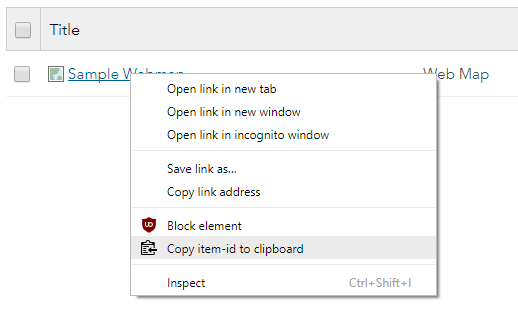

# arcgis-item-id-extractor
A simple Chrome extension to copy the item-id of an item on ArcGIS Online to the clipboard. Right click on any link that matches the patterns listed below and click 'Copy item-id to clipboard` to extract the item id and copy it to the clipboard:

Availabe [here](https://chrome.google.com/webstore/detail/arcgis-item-id-extractor/mlelopenabdjdleeijfiakmddpponpol) on the Chrome Web Store

### Supports the following link types:
 -  `*://*.arcgis.com/home/item.html?id=*`
 -  `*://*.arcgis.com/home/webmap/viewer.html?webmap=*`
 
### Installation/Setup

1. Clone/fork this repository
2. [Enable developer extensions in Chrome](https://developer.chrome.com/extensions/faq#faq-dev-01)
3. Click load an unpacked extension and select the folder containing the code
4. The extension should now be loaded## Issues

## Issues & Contributing

Find a bug or want to request a new feature?  Please let me know by submitting an issue or a PR.
